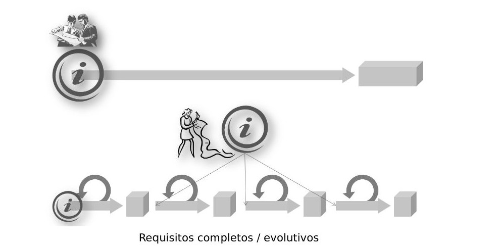

# Artefactos (herramientas)

Scrum, propone herramientas o "artefactos" para mantener organizados nuestros proyectos. Estos artefactos, ayudan a planificar y revisar cada uno de los Sprints, aportando medios ineludibles para efectuar cada una de las ceremonias que veremos más adelante. Ahora, nos concentraremos principalmente, en las Historias de Usuario, las Historias Técnicas, la Pila del Producto, la Pila del Sprint, el Incremento y el Tablero de Tareas, para luego hablar brevemente sobre los Gráfico de Avances.

- Historias de Usuario: consiste en la descripción del sistema desde el punto de vista del usuario.
- Historias Técnicas: cosas que deben hacerse pero que no son un entregable ni están directamente relacionadas con ninguna historia de usuario específica, y no son de valor inmediato para el Dueño del Producto.
- Pila del Producto: lista priorizada de todo lo que requiere el software según los requisitos (historias) del usuario, que a partir de la visión inicial del producto crece y evoluciona durante el desarrollo.
- Pila del Sprint: lista de las tareas necesarias que debe realizar el equipo durante el Sprint, para convertir parte de la Pila del Producto en el
incremento previsto como funcionalidad del software.
- Incremento: es resultado obtenido de cada Sprint. Es la parte del producto realizada en un Sprint potencialmente entregable: terminada y probada.
- Tablero de Tareas: permite la transparencia de los ítems de trabajos pendientes, en curso y terminados de un mismo Sprint.
- Gráfico de Avance: Otro artefacto propio del modelo estándar que el equipo actualiza a diario para comprobar el avance.

Antes de entrar en detalle sobre los artefactos mencionados, aclaremos qué significado tienen los requisitos en el desarrollo ágil.

## Reqisitos

La ingeniería del software clásica diferencia dos ámbitos de requisitos:

- **Requisitos del Sistema**
- **Pila del Producto**

Los **Requisitos del Sistema** forman parte del proceso de adquisición, y por tanto es responsabilidad del usuario la definición del problema y de las funcionalidades que debe aportar la solución. No importa si se trata de gestión tradicional o ágil. La **Pila del Producto** es responsabilidad del usuario, aunque se aborda de forma diferente en cada caso.

- En los proyectos predictivos, los **Requisitos del Sistema** suelen especificarse en documentos formales; mientras que en los proyectos ágiles toman la forma de **Pila del Producto** o lista de Historias de Usuario.
- Los **Requisitos del Sistema** formales se especifican de forma completa y cerrada al inicio del proyecto; mientras que una **Pila del Producto** es un documento vivo, que evoluciona durante el desarrollo.
- Los **Requisitos del Sistema** los desarrolla una persona o equipo especializado en ingeniería de requisitos a través del proceso de licitación con el usuario; en el desarrollo ágil la visión del usuario es conocida por todo el equipo (el usuario colabora con el equipo) y la **Pila del Producto** se realiza y evoluciona de forma continua con los aportes de todos.

Scrum emplea dos formatos para registrar los requisitos:

- **Pila del Producto** _(Product Backlog)_
- **Pila del Sprint** _(Sprint Backlog)_

La **Pila del Producto** registra los requisitos vistos desde el punto de vista del usuario. Un enfoque similar al de los requisitos del sistema de la ingeniería tradicional. Está formada por la lista de funcionalidades o "Historias de Usuario" que desea obtener el Dueño del Producto, ordenadas por la importancia (prioridad) que el mismo le otorga a cada una.

La **Pila del Sprint** está formada por la lista de tareas en las que se descomponen las Historias de Usuario que se van a llevar a cabo en el Sprint. En el desarrollo y mantenimiento de la Pila del Producto lo relevante no es tanto el formato, sino que:

- Las funcionalidades que incluye den forma a una visión del producto definida y conocida por todo el equipo.
- Las funcionalidades estén individualmente definidas, priorizadas y preestimadas.
- Las funcionalidades estén realizada y gestionada por el usuario principal (Dueño del Producto).
