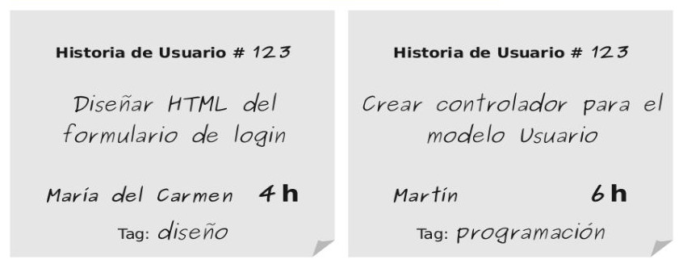

# Pila del Sprint

>La Pila del Sprint es una lista reducida de ítems de la Pila del Producto, que han sido negociados entre el Dueño del Producto y el Equipo de Desarrollo durante la planificación del Sprint. Esta lista, se genera al comienzo de cada Sprint y representa aquellas características que el equipo se compromete a desarrollar durante la iteración actual.

La Pila del Sprint es la lista que descompone las funcionalidades de la Pila del Producto (Historias de Usuario) en las tareas necesarias para construir un incremento: una parte completa y operativa del producto. La realiza el equipo durante la reunión de planificación del Sprint, auto-asignando cada tarea a un miembro del equipo, e indicando en la misma lista cuánto esfuerzo se prevé que falta para terminarla.

La Pila del Sprint descompone el trabajo en unidades de tamaño adecuado para monitorizar el avance a diario, e identificar riesgos y problemas sin
necesidad de procesos de gestión complejos. Los ítems incluidos en la Pila del Sprint se dividen en tareas las cuales generalmente, no demanden una duración superior a un día de trabajo del miembro del equipo que se haya asignado dicha tarea. Se actualiza diariamente por el equipo y de manera permanente, muestra:
- Las tareas pendientes, en curso y terminadas.
- La estimación del esfuerzo pendiente de cada tarea sin concluir.
- El nombre del miembro del equipo que se ha asignado dicha tarea.

Generalmente, la Pila del Sprint, se visualiza mediante un tablero físico, montado en alguna de las paredes de la sala de desarrollo.

Es muy frecuente, a la vez de ser una práctica recomendada, que cada tarea sea a la vez _"etiquetada"_, diferenciando por ejemplo cuando representa
una corrección de error, una tarea de diseño, una prueba, etc.

## Dividiendo Historias de Usuario en tareas

La estrategia consiste en desmembrar el item a la mínima expresión posible, encuadrada en un mismo tipo de actividad. El desmembramiento debe
hacerse _"de lo general a lo particular, y de lo particular al detalle"_. 

**Análisis General**: Es aquel que responde a la pregunta _¿qué es?_

**Por ejemplo**: Un sistema de validación de usuarios registrados

**Análisis Particular**: Es el que responde a la pregunta _¿cómo hacerlo?_

**Por ejemplo**: Arquitectura MVC (requiere hacer el modelo, la lógica y la GUI de la vista y el controlador).

**Análisis Detallado**: Es el que responde a la pregunta general _¿qué tareas se necesitan hacer para lograrlo?_ Los detalles, son aquellas restricciones que deberán considerarse para todo lo anterior.

**Por ejemplo**: La creación del modelo, repercutirá en la base de datos. Por lo cual, tras crear los nuevos modelos, habrá que correr el ORM para que modifique las tablas.

## Otro detalle a considerar, es el tiempo que demanda cada tarea.

**Por ejemplo**: Correr un ORM lleva solo algunos minutos, pues no puede ser considerado una única tarea. Entonces, puede _"sumarse como detalle"_ a la tarea _"crear modelos"_. De manera contraria, documentar en el manual del usuario, llevará todo un día de trabajo. Por lo cual, debe asignarse a una única tarea.

**Entonces se debe**:

- Crear el modelo Usuario y correr el ORM para modificar las tablas
    - Etiqueta: programación
    - Esfuerzo: 2 h
- Diseñar un formulario HTML para insertar usuario y contraseña
    - Etiqueta: diseño
    - Esfuerzo: 4 h

- Desarrollar la lógica de la vista del formulario para el logueo
    - Etiqueta: programación
    - Esfuerzo: 4 h
- Crear el controlador para el modelo
    - Etiqueta: programación
    - Esfuerzo: 6 h
- Correr las pruebas e integrar
    - Etiqueta: prueba
    - Esfuerzo: 1 h
    
Finalmente, dichas tareas se plasmarán en diferentes fichas (una tarea en cada uno). Los miembros del equipo decidirán qué tareas se asignará cada uno y se colocarán las fichas en el tablero:

Es también una herramienta para la comunicación visual directa del equipo.

## Condiciones

- Sólo el equipo la puede modificar durante el Sprint.
- Es realizada de forma conjunta por todos los miembros del equipo.
- Cubre todas las tareas identificadas por el equipo para conseguir el objetivo del Sprint.
- Es visible para todo el equipo. Idealmente en un tablero o pared en el mismo espacio físico donde trabaja el equipo.
- Las tareas demasiado grandes deben descomponerse en otras más pequeñas. Se deben considerar “grandes” las tareas que necesitan más de un día para realizarse.

## Formato y soporte

Son soportes habituales:

- Tablero físico o pared.
- Hoja de cálculo.
- Herramienta colaborativa o de gestión de proyectos.

Y sobre el más adecuado a las características del proyecto, oficina y equipo, lo apropiado es diseñar el formato más cómodo para todos, teniendo en cuenta los siguientes criterios:

- Incluir sólo la información estrictamente necesaria.
- Facilitar la consulta y la comunicación diaria y directa del equipo.
- Debe servir de medio para registrar en cada reunión de Apertura Diaria del Sprint, el tiempo que le _“debería”_ quedar a cada tarea.
- Incluir la siguiente información: Pila del Sprint, persona responsable de cada tarea, estado en el que se encuentra y tiempo de trabajo que queda para completarla.

>Durante el Sprint, el equipo actualiza a diario en ella los _“tiempos pendientes”_ de cada tarea. Al mismo tiempo, con estos datos traza en el Gráfico de Avance el trabajo consumido.

